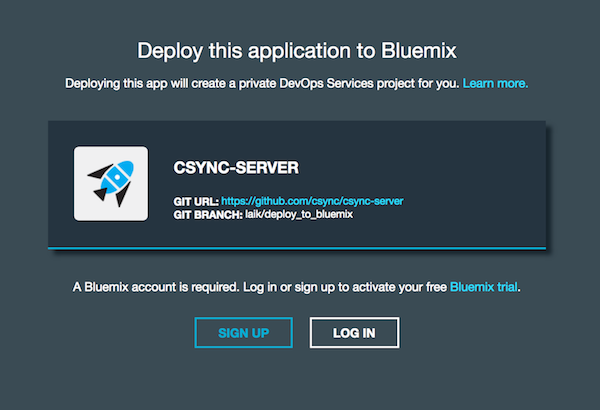
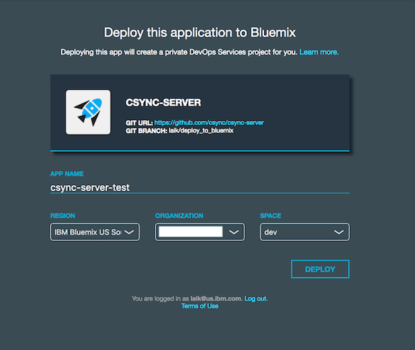
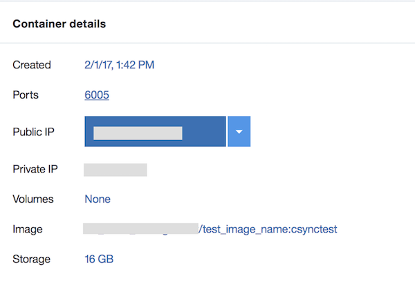

# Contextual Sync 
[](https://travis-ci.org/csync/csync-server)
[![License][license-svg]][license-link] 

[license-svg]: https://img.shields.io/hexpm/l/plug.svg
[license-link]: https://github.com/csync/csync-server/blob/master/LICENSE

Contextual Sync (CSync) is an open source, real-time, continuous data synchronization service for building modern applications. The CSync data store is organized with key/values where keys have a hierarchical structure. Clients can obtain the current value for a key and any subsequent updates by listening on the key. Updates are delivered to all online clients in near-real time. Clients can also listen on a key pattern where some components contain wildcards. 

## Keys
CSync is structured as a tree of nodes referenced by period-delimited strings called keys.

To illustrate :

```
          companies
       /              \
    ibm                google
   /   \               /     \ 
stock   offices    stock   offices
```

The above tree consists of the following keys : `companies`, `companies.ibm`, `companies.google`, `companies.ibm.stock`, `companies.ibm.offices`, `companies.google.stock`, `companies.google.offices`. Any one of these keys can be listened to at a time and all changes to that singular node will be synced to the client device. 

### Key Limitations
Keys can have a maximum of 16 parts and a total length of 200 characters. Key components may contain only uppercase and lowercase alphabetic, numeric, "_", and "-".

Valid key: `this.is.a.valid.key.123456.7.8.9.10`

Invalid key: `this is an.invalidkey.🍕.4.5.6.7.8.9.10.11.12.13.14.15.16.17.18`

### Wildcards in Keys
Suppose a developer wishes to listen to a subset of the tree containing multiple nodes, CSync provides this ability through wildcards. Currently CSync supports `*` and `#` as wildcards. 

#### Asterisk Wildcard
An Asterisk (`*`) wildcard will match any value in the part of the key where the wildcard is. As an example, if a developer listens to `companies.*.stock` in the above tree, the client will sync with all stock nodes for all companies.

#### Hash Wildcard
If a developer wishes to listen to all child nodes in a subset of the tree, the `#` can appended to the end of a key and the client will sync with all child nodes of the specified key. For instance in the above tree if a user listens to `companies.ibm.#`, then the client will sync with all child nodes of `companies.ibm` which include `companies.ibm.stock` and `companies.ibm.offices`. 

**Note:** Each listen is independent. For example, if a developer listens to both `companies.*.stock` and `companies.companyX.stock`, the data from `companies.companyX.stock` will be received by both of the listeners. 

## Guaranteed Relevance
Only the latest, most recent, values sync, so you’re never left with old data. CSync provides a consistent view of the values for keys in the CSync store. If no updates are made to a key for a long enough period of time, all subscribers to the key will see the same consistent value. CSync guarantees that the latest update will be reflected at all connected, subscribed clients, but not that all updates to a key will be delivered. Clients will not receive an older value than what they have already received for a given key.

## Local Storage
Work offline, read and write, and have data automatically sync the next time you’re connected. CSync maintains a local cache of data that is available to the client even when the client is offline or otherwise not connected to the CSync service. The client may perform listens, writes, and deletes on the local store while offline. When the client reestablishes connectivity to the CSync service, the local cache is efficiently synchronized with the latest data from the CSync store. The local cache is persistent across application restarts and device reboots.

## Authentication
Authenticate in an ever-growing number of ways from the provider of your choice. Currently the following methods are supported:
- [Google OAuth](https://developers.google.com/identity/protocols/OAuth2) `google`
- [Github Auth](https://developer.github.com/v3/oauth/) `github`
- [Facebook Auth](https://developers.facebook.com/docs/facebook-login/access-tokens) `facebook`
- Demo Login `demo`

### Demo Login
The Demo Login is an easy way of getting started with CSync. Just provide the `demo` authentication provider and the `demoToken` to authenticate as a demo user. This token allows for multiple user accounts as long as it is in the form `demoToken({someString})`. For example: `demoToken(abc)`, `demoToken` and `demoToken(123)` would all be treated as different user accounts.

## Access Controls
Use simple access controls to clearly state who can read and write, keeping your data safe. Each key in the CSync store has an associated access control list (ACL) that specifies which users can access the key. 

Three specific forms of access are defined:
- Create: Users with create permission may create child keys of this key.
- Read: Users with read permission may read the data for the key.
- Write: Users with write permission may write the data for the key.

The creator of a key in the CSync store has special permissions to that key. In particular, the creator always has Read, Write, and Create permissions, and they also have permission to delete the key and change its ACL.

CSync provides eight "static" ACLs that can be used to provide any combination of Read, Write, and Create access to just the key's creator or all users.
- Private
- PublicRead
- PublicWrite
- PublicCreate
- PublicReadWrite
- PublicReadCreate
- PublicWriteCreate
- PublicReadWriteCreate

The ACL for a key is set when the key is created by the first write performed to the key. If the write operation specified an ACL, then this ACL is attached to the key. If no ACL was specified in the write, then the key inherits the ACL from its closest ancestor in the key space—its parent if the parent exists, else its grandparent if that key exists, possibly all the way back to the root key. The ACL of the root key is `PublicCreate`, which permits any user to create a child key but does not allow public read or write access.

# Getting Started

### Local Deployment

1. Download and install [Docker], gulp and sbt:
  - docker https://www.docker.com/products/overview
  - gulp `npm install --global gulp-cli`
  - sbt `brew install sbt`
  
2. Clone this Repo
  
3. Make csync image from the root folder:

  - `make image`

4. Run the csync image:

  - `docker run -d -p 6005:6005 csync`

  To enable **Google Authentication** add in an environment variable like so:
  
  - `docker run -d -p 6005:6005 -e CSYNC_GOOGLE_CLIENT_IDS="CLIENTID HERE" csync`
  
  To enable **GitHub Authentication** add in a client ID and client Secret 
  
  - `docker run -d -p 6005:6005 -e CSYNC_GITHUB_ID githubIdHere -e CSYNC_GITHUB_SECRET githubSecretHere csync`
  
  To enable **Facebook Authentication** add in an app ID and app secret 
  
  - `docker run -d -p 6005:6005 -e CSYNC_FACEBOOK_ID facebookIdHere -e CSYNC_FACEBOOK_SECRET facebookSecretHere csync`
  
  All of the authentication providers can be enabled at the same time by having each environment variables specified.
  
### Deploy on Bluemix
  Click [here] (https://github.com/csync/csync-server/wiki/Create-a-CSync-Instance-on-Bluemix) to manually setup CSync on Bluemix.

  You can also try the `Deploy to Bluemix` button which creates an instance of CSync on Bluemix, provided your organization already has a [namespace](https://console.ng.bluemix.net/docs/containers/container_planning_org_ov.html). 
  
  <a href="https://bluemix.net/deploy?repository=https://github.com/csync/csync-server&branch=master"></a>
  1. Login to Bluemix:
  
  

  2. Choose a name for you application. Select your `region`, `org` and `space` and click `deploy`: 

  
  
  3. After the deployment is complete, the CSync instance will be listed in your [Bluemix dashboard](https://console.ng.bluemix.net/dashboard/containers).
  4. From the dashboard, click on the CSync instance and use the Public IP and port to connect to your CSync instance:
  
  

  Need to handle workloads larger than what's possible with a single instance? [Check this out](https://github.com/csync/csync-server/wiki/Using-external-PostgreSQL-and-RabbitMQ-instances)

## Dataviewer

When running a local CSync instance, the dataviewer can be accessed on `localhost:6005`. Currently the dataviewer supports Google Authentication and Guest Login. For details on how to use the dataviewer, checkout the [README](https://github.com/csync/csync-server/blob/master/vertx/public/dataviewer/README.md). 
You also have the option to disable the dataviewer by setting the `DISABLE_DATAVIEWER` environment variable to `true`. This variable is `false` by default. 

NOTE: Chrome is the only supported browser at this time. Contributions to supporting other browsers are welcome.

## Additional Commands
`docker ps` will list out running containers and the images within.

`docker images` will list out available local docker images.

In case you need a new image, you need to stop and delete the old one by running `docker kill <docker container #>` and `docker rm <docker container #>`

## Troubleshooting
Having issues with the server? Check out the debugging article [here] (https://github.com/csync/csync-server/wiki/Debugging-a-server-problem).

## Privacy Notice

This web application includes code to track deployments to [IBM Bluemix](https://www.bluemix.net/) and other Cloud Foundry platforms. The following information is sent to a [Deployment Tracker](https://github.com/cloudant-labs/deployment-tracker) service on each deployment:

* Space ID (`space_id`)
* Application ID (`application_id`)
* Number of instances

### Disabling Deployment Tracking

Deployment tracking can be disabled by commenting out the following code in `vertx/src/main/scala/com/ibm/csync/vertx/Main.scala`:

```
 val f: File = new File("public/package.json")
    if (f.exists()) {
      val is = new FileInputStream("public/package.json")
      val json: JSONArtifact = JSON.parse(is, true)
      logger.info(json.toString)
      val client = new CFJavaTrackerClient().track(json.asInstanceOf[JSONObject])
    }
```

# License
This library is licensed under Apache 2.0. Full license text is
available in [LICENSE](LICENSE).

# Contribution Guide
Want to contribute? Take a look at our [CONTRIBUTING.md](https://github.com/csync/csync-server/blob/master/.github/CONTRIBUTING.md)
